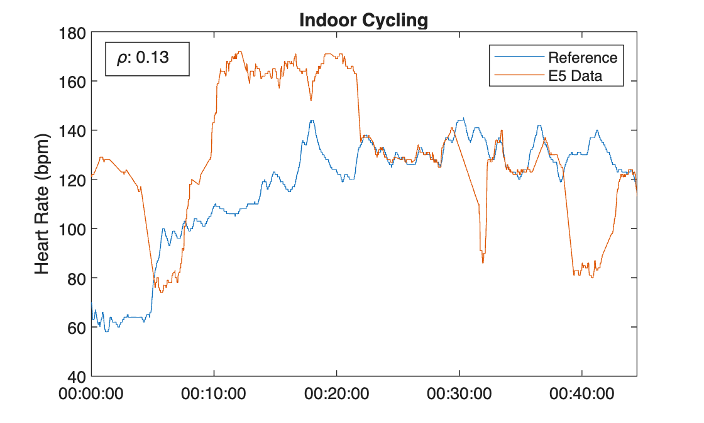
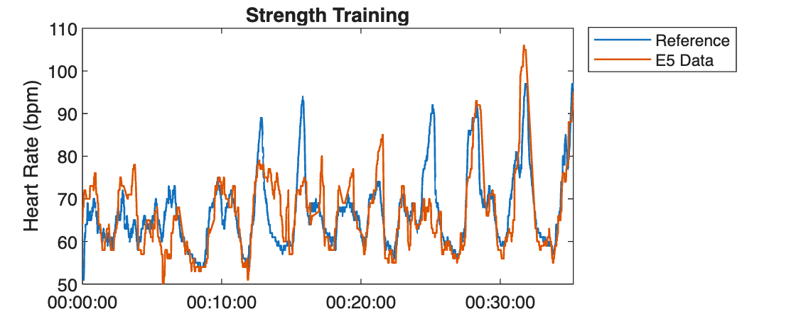
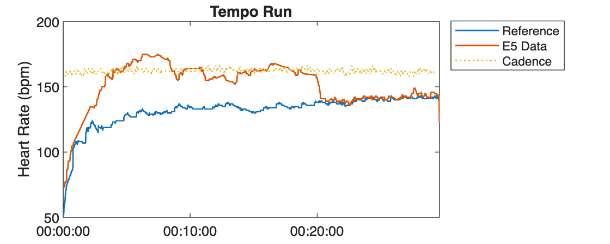
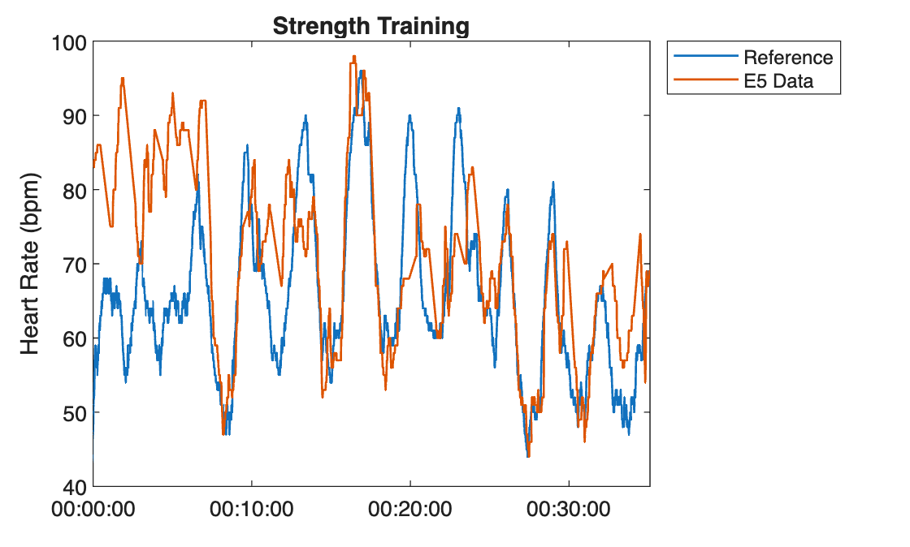
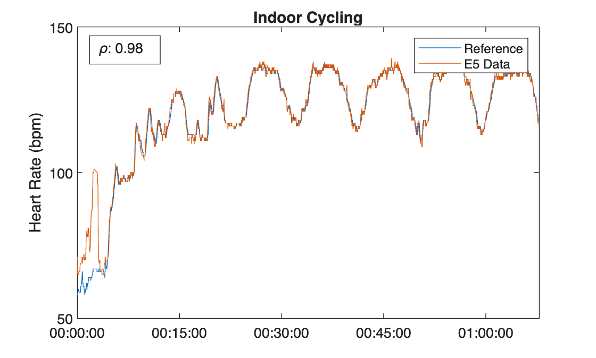

# Analyzing Heart Rate Accuracy for Tag Heuer Connected Calibre E5

Comparing the heart rate measurements, during activities, of my Tag Heuer Connected Calibre E5 × New Balance Edition (reference SBT8082.EB0394). That this reference has a case diameter of 40mm and the case material is titanium.


```matlabTextOutput
-------------------------------------------------------
MATLAB Version: 25.2.0.3123386 (R2025b) Update 3
MATLAB License Number: 41249549
Operating System: macOS  Version: 15.7.3 Build: 24G419 
Java Version: Java is not loaded
-------------------------------------------------------
MATLAB                                                Version 25.2        (R2025b)
Curve Fitting Toolbox                                 Version 25.2        (R2025b)
Optimization Toolbox                                  Version 25.2        (R2025b)
Statistics and Machine Learning Toolbox               Version 25.2        (R2025b)
Symbolic Math Toolbox                                 Version 25.2        (R2025b)
```

# Activity 1: Indoor Cycling 2026\-02\-04
-  Tag Heuer OS version 5.5.16 
-  Tag Heuer Sports version 1.5.8 
-  Black rubber strap worn normally (hole 4) 
-  Reference data from Polar OH1 via Wahoo Bolt 


# Activity 2: Strength Training 2026\-02\-04
-  Tag Heuer OS version 5.5.16 
-  Tag Heuer Sports version 1.5.8 
-  New Balance Velcro Strap worn tight 
-  Reference data from Amazfit Helio Strap 


# Activity 3: Tempo Run 2026\-02\-05
-  Tag Heuer OS version 5.5.16 
-  Tag Heuer Sports version 1.5.8 
-  New Balance Rubber Strap worn tight (hole 3) 
-  Reference data from Amazfit Helio Strap 
-  Cadence data from Stryd footpod 


# Activity 4: Strength Training 2026\-02\-06
-  Tag Heuer OS version 5.5.16 
-  Tag Heuer Sports version 1.5.8 
-  Black Rubber Strap worn tight (hole 3) 
-  Reference data from Amazfit Helio Strap 


# Activity 5: Indoor Cycling 2026\-02\-07
-  Tag Heuer OS version 5.5.16 
-  Tag Heuer Sports version 1.5.8 
-  New Balance Velcro Strap worn tight and 15mm higher on arm 
-  Reference data from Polar OH1 via Wahoo Bolt 


